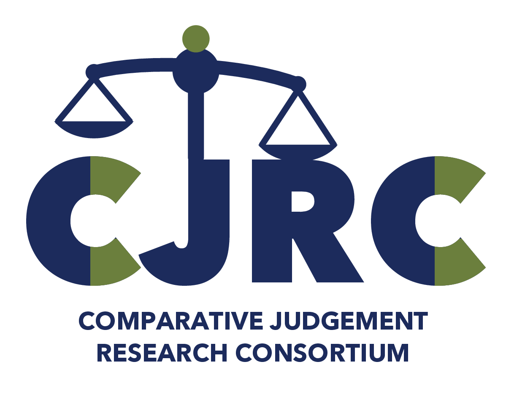
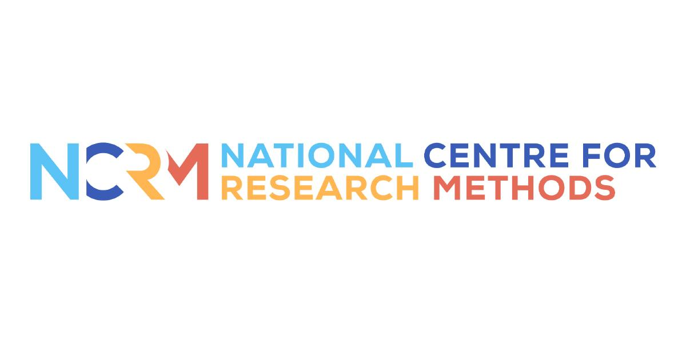
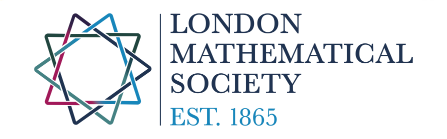

<!-- Page-scoped styles for hero (edit text below as needed) -->

<!-- Carousel styles for acknowledgements logos -->

<!-- Hero block: edit the text below to customise the hero -->

 	

 		

 			<h1>Comparative Judgement Research Consortium</h1>
 			
An international consortium of researchers and practitioners who use, apply and develop comparative judgement methods.

 			
<a class="btn btn-primary" href="http://www.jiscmail.ac.uk/COMPARATIVE-JUDGEMENT" target="_blank" rel="noopener noreferrer">Sign up to our mailing list</a>

 		

 		

 			
 		

 	

The Comparative Judgement Research Consortium (CJRC) brings together researchers and practitioners from statistics, education, psychology, linguistics, political science, computer science and beyond to discuss comparative judgement. We run regular meetings across the UK and Europe, maintain the largest open collection of comparative judgement datasets, and set the research agenda for the field. The consortium is convened by [Ian Jones](https://www.lboro.ac.uk/departments/maths-education/staff/ian-jones/) (Loughborough University), [Marie-Josée Bisson](https://www.lboro.ac.uk/schools/science/staff/marie-josee-bisson/) (Loughborough University) and [Rowland Seymour](https://www.birmingham.ac.uk/staff/profiles/maths/seymour-rowland) (University of Birmingham).

	
8meetings held since 2024, in the UK and Belgium

	
36<a href="/cj_rave.html">grand-challenge research questions</a> co-created by 25 experts

	
105<a href="/resources/repo.html">open comparative judgement datasets</a>

	
50+papers in our <a href="/resources/articles.html">bibliography</a>

## What we do

	

		<h3>Meetings</h3>
		
Full-day meetings several times a year, hosted by member institutions, with talks from across the disciplines and structured discussion.

	

	

		<h3>Grand Challenges</h3>
		
In May 2026, 25 experts from statistics, education, psychology, politics and computer science co-created a <a href="/cj_rave.html">research agenda for comparative judgement</a>: 36 open questions in seven themes.

	

	

		<h3>Reading group</h3>
		
An online <a href="/reading_group.html">reading group</a>, running since 2024, discussing papers from Thurstone (1927) to the latest work on comparative judgement and large language models.

	

	

		<h3>Resources</h3>
		
A curated <a href="/resources/repo.html">data repository</a>, a <a href="/resources/articles.html">bibliography</a>, a guide to <a href="/resources/software.html">software</a> for collecting and analysing comparisons, and <a href="/resources/guidance.html">guidance</a> for researchers new to the method.

	

## What is comparative judgement?

Comparative judgement is a method for measuring quality, or any other latent trait, by asking judges to compare items in pairs rather than to score them one at a time. Its foundations go back to Thurstone's (1927) *law of comparative judgement*, which says that people are far more consistent at deciding which of two things is better than at placing one thing on an absolute scale.

	<ol>
		<li>Judges are shown two items, such as essays, proofs, images or research proposals, and choose which is better against a holistic criterion.</li>
		<li>Many such decisions are collected from many judges, with each item appearing in several pairs.</li>
		<li>A statistical model, typically Bradley&ndash;Terry or a Bayesian extension of it, combines the decisions into a measurement scale for the items and estimates its reliability.</li>
	</ol>

Comparative judgement is now used across social and physical sciences. For example, in psychology to measure conceptual understanding, in linguistics to study language processing, in political science to measure attitudes and priorities, in statistics to model everything from urban deprivation to sports results, and increasingly to evaluate the outputs of large language models. Members of the consortium have published on all of these; our [bibliography](/resources/articles.html) is a good place to start, and our [guidance](/resources/guidance.html) page explains how to run a first study.

## Join the consortium

Membership is open to anyone working with, or interested in, comparative judgement. Joining our mailing list brings news of meetings, the reading group and calls for collaboration.

	
<a class="btn btn-primary" href="http://www.jiscmail.ac.uk/COMPARATIVE-JUDGEMENT" target="_blank" rel="noopener noreferrer">Subscribe on JISCMail</a>

	
Alternatively, email <code>LISTSERV@JISCMAIL.AC.UK</code> with the message body <code>SUBSCRIBE COMPARATIVE-JUDGEMENT FirstName LastName</code>.

## Acknowledgements
Our work is supported by the Engineering and Physical Sciences Research Council through a Mathematical Sciences Discipline Hopping Grant [UKRI2389] and a UKRI Future Leaders Fellowship [MR/X034992/1]. The consortium was established with a National Centre for Research Methods Special Interest Group grant, and our meetings have been hosted and funded by the London Mathematical Society, Bath Spa University, De Montfort University, the University of Birmingham, Loughborough University and the Université de Liège.

<!-- Logos carousel (one logo per slide) -->

	

		

		

		

		

		

		

	

	<button class="carousel-button prev" aria-label="Previous logo">‹</button>
	<button class="carousel-button next" aria-label="Next logo">›</button>
	

		<button class="dot" aria-label="Logo 1" aria-selected="true"></button>
		<button class="dot" aria-label="Logo 2" aria-selected="false"></button>
		<button class="dot" aria-label="Logo 3" aria-selected="false"></button>
		<button class="dot" aria-label="Logo 4" aria-selected="false"></button>
		<button class="dot" aria-label="Logo 5" aria-selected="false"></button>
		<button class="dot" aria-label="Logo 6" aria-selected="false"></button>
	

	

